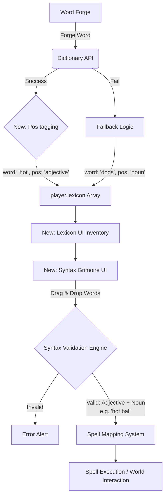
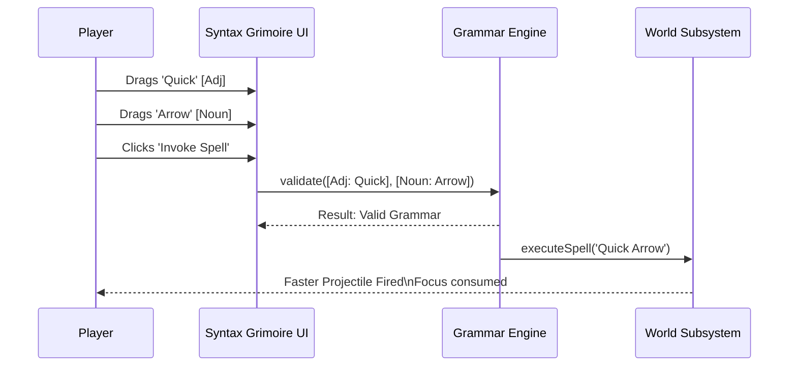

# Concept 1: The Syntax Sorcery (Grammar & Sentence Construction) - Architectural Blueprint & Implementation Plan

## Architectural Overview

This expansion fundamentally pivots WordCraft from morphology (word formation) to syntax (sentence formation). We will introduce a new core game loop where forged words are stored with their "Part of Speech" metadata and then slotted into structural "Syntax Receptors" to trigger environmental interactions or combat abilities.

### High-Level Architecture Flow

### Core Systems Additions

1.  **Vocabulary Inventory (The Lexicon):**
    *   **Data Structure:** A new array in the `player` object: `player.lexicon = [{ word: 'hot', pos: 'adjective', strength: 1 }, ...]`
    *   **Population:** Upon a successful `forgeWord()` dictionary API call, the resulting word and its part of speech (`partOfSpeech`) are pushed to `player.lexicon` instead of just yielding resources.
    *   **UI Integration:** A new tab or panel in the Inventory (`#screen-inv`) displaying available words categorized by their Part of Speech (Nouns, Verbs, Adjectives).

2.  **The Syntax Grimoire (Grammar Engine):**
    *   **UI Component:** A new pop-up overlay (similar to `#screen-inv` or `#screen-saves`) called `#screen-syntax`.
    *   **Mechanics:** Contains designated slots (e.g., `[Adjective]`, `[Noun]`, `[Verb]`). Players drag words from their `lexicon` into these slots.
    *   **Validation:** An engine that checks if the sequence is grammatically permissible and maps combinations to specific spell IDs or outcomes.

3.  **Spell System & World Interaction:**
    *   **Data Structure:** A mapping of valid syntax patterns to game functions. For example: `[Adjective: hot] + [Noun: ball] + [Verb: throw] = function castFireball(...)`.
    *   **Spell execution:** An active spell system where the current "Grammar Spell" is mapped to an action button or triggered situationally (e.g., interacting with a specific obstacle).

4.  **Environmental Puzzles (Grammar Gates):**
    *   **Entities:** New map tile types or NPC-like objects (e.g., "The Door of Nouns") that require a specific Part of Speech or a specific sentence structure to bypass.
    *   **Interaction:** Pressing Space near them opens a mini-syntax UI demanding a solution sentence.

## Execution Phased Checklist for Implementation Agents

Agents are instructed to execute these phases sequentially, testing functionality at the end of each phase before proceeding.

### Phase 1: Foundational Data & The Lexicon (1-2 Commits)
- [ ] **Objective:** Capture forged words and their Part of Speech data and store them persistently in the player's save data.
- [ ] Modify `player` state initialization to include an empty array: `lexicon: []`.
- [ ] In `forgeWord()`, upon a successful dictionary API hit, push an object `{ word: finalWord, pos: partOfSpeech }` to `player.lexicon`.
    *   *Agent Note: You must handle the fallback logic where simple suffixes like 's' are validated locally to ensure they also receive a basic POS tag.*
- [ ] Add a visual notification (toast or UI element update) indicating a word was added to the Lexicon.
- [ ] Ensure `player.lexicon` is properly serialized and deserialized within the existing save/load logic.

### Phase 2: The Lexicon User Interface (2-3 Commits)
- [ ] **Objective:** Allow the player to view their captured words, categorized by grammatical function.
- [ ] Add a new Tab to the Inventory screen (`#screen-inv`) titled "Lexicon" alongside "Word Forge" and "Craft".
- [ ] Within the "Lexicon" tab, create three distinct visual zones or accordions: Nouns, Verbs, and Adjectives.
- [ ] Write a render function `renderLexiconUI()` that iterates over `player.lexicon` and populates these zones as draggable/selectable UI chips.

### Phase 3: The Syntax Grid Engine & UI (2-3 Commits)
- [ ] **Objective:** Build the core UI for assembling sentences and the underlying logic to validate them.
- [ ] Create a new UI layer or tab called the "Syntax Grimoire" containing blank slots representing sentence structures. Start simple: `[Adjective Slot] + [Noun Slot] + [Verb Slot]`.
- [ ] Implement UI interactions allowing chips from the Lexicon to be moved into these slots.
- [ ] Implement `validateSentence(adj, noun, verb)` logic to verify the slots are filled correctly according to the required Part of Speech metadata attached to the word objects.
- [ ] Add an "Invoke Spell" button that is enabled only when a valid syntax sequence is present.

### Phase 4: Spell Execution & Mapping (2-3 Commits)
- [ ] **Objective:** Connect successful sentences to tangible game mechanics.
- [ ] Create a `SpellDictionary` mapping specific word combinations or generic patterns to actions. For example, `(any adjective) + (Noun: Arrow) + (any verb)` might trigger an enhanced arrow shot.
- [ ] Implement placeholder functions for at least three distinct spells (e.g., throwing a projectile, healing, removing a specific tile block).
- [ ] Connect the "Invoke Spell" button from Phase 3 to execute the mapped function based on the current sentence, and consume "Focus" points or Lexicon charges if appropriate.

### Phase 5: Grammar Gates & Integration (2 Commits)
- [ ] **Objective:** Create environmental blockers that mandate the use of the Syntax Sorcery mechanics to progress.
- [ ] Create a new tile ID in the grid map logic (e.g., tile ID 20) representing a "Grammar Inscription".
- [ ] Update the `interact()` function: If the player interacts with tile ID 20, open a specific dialog or a specialized Syntax UI requesting a specific grammatical structure (e.g., "This door demands a fast action. Provide: [Adverb] + [Verb]").
- [ ] Upon successfully providing the correct sentence, remove the tile block.

### Phase 6: Polish and Scaling (1 Commit)
- [ ] **Objective:** Refining UX and adding more content.
- [ ] Expand the `SpellDictionary` to parse more complex intent based on synonyms and specific words rather than just POS categories.
- [ ] Ensure Mobile UI controls gracefully handle opening the Syntax Grimoire and moving lexicon chips.
- [ ] Final end-to-end testing of the entire loop: Forging -> Lexicon -> Sentence Assembly -> Spell Execution -> World Interaction.
