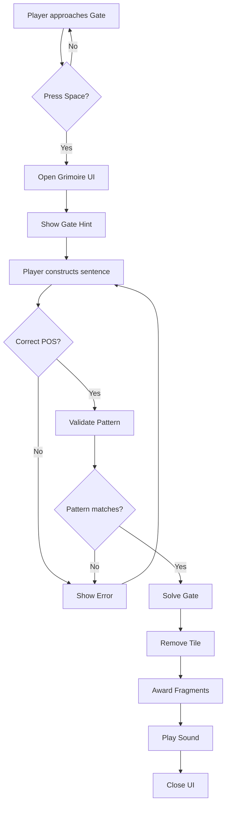

# Phase 5: Grammar Gates - Implementation Plan

**Status:** Ready for Implementation  
**Dependencies:** Phase 4 (Spell System) ✅ Complete  
**Risk Level:** LOW - Isolated feature addition  
**Branch:** `feature/grammar-gates`

---

## Overview

Grammar Gates are environmental puzzles that require players to construct grammatically correct sentences to unlock barriers. This adds an educational layer where players must demonstrate understanding of parts of speech to progress through the world.

---

## Current Tile System Analysis

### Existing Tile IDs (from code analysis)

| ID | Type | Description | Usage |
|----|------|-------------|-------|
| 0 | Air | Empty space | Movement |
| 1 | Dirt | Basic terrain | Mining |
| 2 | Stone | Hard terrain | Mining (requires Wood Pickaxe) |
| 3 | Obsidian | Very hard terrain | Mining (requires Stone Pickaxe) |
| 4 | Plank | Crafted block | Building |
| 5 | Stone Brick | Crafted block | Building |
| 6 | Magic Door | Special block | Building |
| 7 | Wood (Tree trunk) | Natural resource | Mining |
| 8 | Leaves | Natural resource | Mining |
| 9 | Dirt Wall | Crafted block | Building |
| 11 | Sun Lantern | Light source | Building |
| 12 | Sand | Terrain layer | Mining |
| 13 | Ladder | Climbable | Building |

### Available Tile IDs

**Recommended:** Tile ID `20` (Grammar Gate)  
**Alternative:** Tile IDs `14-19` or `21+` are also available

---

## Architecture Design

### 1. Data Structures

#### Grammar Gate Definition
```javascript
// In player object (index.html)
player.grammarGates = [
  {
    id: 'gate_1',
    x: 30,
    y: 15,
    requirement: {
      pattern: 1,  // Pattern ID from PATTERNS
      requiredPOS: ['adjective', 'noun', 'verb'],
      hint: "The ancient door demands: [Adjective] [Noun] [Verb]"
    },
    solved: false,
    reward: null  // Optional: fragments, items, etc.
  }
];
```

#### Gate Configuration (js/syntax-sorcery.js)
```javascript
const GRAMMAR_GATE_TYPES = {
  basic_noun: {
    name: "Noun Gate",
    pattern: 1,
    requiredPOS: ['adjective', 'noun', 'verb'],
    hint: "This barrier seeks a simple declaration",
    icon: "🚪",
    color: "#9b59b6"
  },
  imperative: {
    name: "Command Gate",
    pattern: 2,
    requiredPOS: ['verb', 'adjective', 'noun'],
    hint: "Speak a command to pass",
    icon: "⚡",
    color: "#e74c3c"
  },
  adverbial: {
    name: "Complex Gate",
    pattern: 4,
    requiredPOS: ['adjective', 'noun', 'verb', 'adverb'],
    hint: "Only the most eloquent may pass",
    icon: "✨",
    color: "#f39c12"
  }
};
```

---

## Implementation Tasks

### Task 5.1: Define Grammar Gate Tile Type ✅

**Goal:** Add new tile ID and visual representation

**Files to modify:**
- [`index.html`](index.html:1322-1439) - Draw function
- [`index.html`](index.html:861-904) - Grid initialization

**Implementation:**

1. **Add tile ID constant** (around line 814):
```javascript
const TILE_GRAMMAR_GATE = 20;
```

2. **Add rendering in draw() function** (around line 1344-1363):
```javascript
// In the tile rendering section
else if(t === 20) {
  // Grammar Gate - Glowing rune barrier
  ctx.fillStyle = "#9b59b6";
  ctx.fillRect(c*TILE_SIZE, r*TILE_SIZE, TILE_SIZE, TILE_SIZE);
  
  // Add glowing effect
  ctx.shadowBlur = 15;
  ctx.shadowColor = "#8e44ad";
  ctx.strokeStyle = "#fff";
  ctx.lineWidth = 2;
  
  // Draw rune pattern
  ctx.beginPath();
  ctx.arc(c*TILE_SIZE + TILE_SIZE/2, r*TILE_SIZE + TILE_SIZE/2, 12, 0, 2*Math.PI);
  ctx.stroke();
  
  // Draw inner symbol
  ctx.font = "20px Arial";
  ctx.fillStyle = "white";
  ctx.textAlign = "center";
  ctx.textBaseline = "middle";
  ctx.fillText("📖", c*TILE_SIZE + TILE_SIZE/2, r*TILE_SIZE + TILE_SIZE/2);
  
  ctx.shadowBlur = 0;
}
```

3. **Add fallback rendering** (around line 1345-1353):
```javascript
// In useFallbackAssets section
else if(t===20) ctx.fillStyle="#9b59b6";
```

**Testing:**
- Manually set a grid tile to 20 and verify visual appearance
- Check that gate renders correctly in both asset modes

---

### Task 5.2: Create Grammar Gate Data Structure ✅

**Goal:** Store gate definitions and track solved state

**Files to modify:**
- [`index.html`](index.html:842-847) - Player initialization
- [`js/syntax-sorcery.js`](js/syntax-sorcery.js:1154-1173) - Grammar Gates module

**Implementation:**

1. **Add to player object** (line 842-847):
```javascript
let player = {
  // ... existing properties ...
  grammarGates: [], // SYNTAX SORCERY: Grammar gate progress
  // ... rest of properties ...
};
```

2. **Expand GrammarGates module** in [`js/syntax-sorcery.js`](js/syntax-sorcery.js:1154-1173):
```javascript
const GrammarGates = {
  init() {
    console.log('[Syntax Sorcery] Grammar Gates initialized');
    
    // Initialize gates if not present
    if (!window.player.grammarGates) {
      window.player.grammarGates = [];
    }
  },
  
  // Register a gate in the world
  registerGate(x, y, gateType, gateConfig) {
    const gate = {
      id: `gate_${x}_${y}`,
      x: x,
      y: y,
      type: gateType,
      requirement: gateConfig.requirement,
      hint: gateConfig.hint,
      solved: false,
      reward: gateConfig.reward || null
    };
    
    window.player.grammarGates.push(gate);
    console.log(`[Grammar Gates] Registered gate at (${x}, ${y})`);
    return gate;
  },
  
  // Find gate at specific coordinates
  getGateAt(x, y) {
    if (!window.player.grammarGates) return null;
    return window.player.grammarGates.find(g => g.x === x && g.y === y);
  },
  
  // Check if gate is already solved
  isGateSolved(x, y) {
    const gate = this.getGateAt(x, y);
    return gate ? gate.solved : false;
  },
  
  // Validate sentence against gate requirements
  validateSentence(gate, words, patternId) {
    if (!gate || !gate.requirement) return false;
    
    // Check if pattern matches
    if (gate.requirement.pattern && gate.requirement.pattern !== patternId) {
      return {
        valid: false,
        message: `This gate requires a different sentence pattern.`
      };
    }
    
    // Check if all required POS are present
    const requiredPOS = gate.requirement.requiredPOS || [];
    for (const pos of requiredPOS) {
      if (!words[pos]) {
        return {
          valid: false,
          message: `Missing required part: ${pos}`
        };
      }
    }
    
    return { valid: true, message: 'Gate accepts your words!' };
  },
  
  // Solve a gate (remove barrier)
  solveGate(x, y) {
    const gate = this.getGateAt(x, y);
    if (!gate) return false;
    
    gate.solved = true;
    
    // Remove tile from grid
    if (window.grid && window.grid[y] && window.grid[y][x] === 20) {
      window.grid[y][x] = 0; // Convert to air
    }
    
    // Award reward if present
    if (gate.reward) {
      if (gate.reward.fragments) {
        window.player.fragments += gate.reward.fragments;
      }
    }
    
    console.log(`[Grammar Gates] Gate at (${x}, ${y}) solved!`);
    return true;
  }
};
```

**Testing:**
- Initialize player and verify grammarGates array exists
- Register test gates and verify data structure
- Test getGateAt() with various coordinates

---

### Task 5.3: Implement Interaction Logic ✅

**Goal:** Allow player to interact with gates and open specialized UI

**Files to modify:**
- [`index.html`](index.html:1125-1129) - Interact function
- [`index.html`](index.html:1171-1307) - Action function

**Implementation:**

1. **Update interact() function** (around line 1125):
```javascript
function interact() {
  // Check for Grammar Gates first
  if (window.SyntaxSorcery && window.SyntaxSorcery.gates) {
    const tx = player.x + (player.facingLeft ? -1 : 1);
    const ty = player.y;
    
    if (tx >= 0 && tx < COLS && ty >= 0 && ty < ROWS) {
      const tile = grid[ty][tx];
      
      if (tile === 20) { // Grammar Gate
        const gate = window.SyntaxSorcery.gates.getGateAt(tx, ty);
        
        if (gate && !gate.solved) {
          openGrammarGateUI(gate);
          return;
        } else if (gate && gate.solved) {
          showToast('✅ This gate has been solved!', 'good');
          return;
        }
      }
    }
  }
  
  // Original NPC interaction
  let talked = false;
  NPCS.forEach(n => { 
    if(Math.abs(player.x - n.x) <= 2 && Math.abs(player.y - n.y) <= 2) { 
      startDialogue(n); 
      talked = true; 
    } 
  });
  
  if(talked) return; 
  action();
}
```

2. **Add Grammar Gate UI opener** (new function after interact):
```javascript
function openGrammarGateUI(gate) {
  console.log('[Grammar Gate] Opening UI for gate:', gate);
  
  // Store current gate in global state
  window.currentGrammarGate = gate;
  
  // Open Grimoire with special mode
  if (window.SyntaxSorcery && window.SyntaxSorcery.syntax) {
    window.SyntaxSorcery.syntax.openGrimoire();
    
    // Show gate hint
    showToast(`🚪 ${gate.hint}`, 'neutral');
    
    // Add gate-specific UI elements
    const preview = document.getElementById('spell-preview');
    if (preview) {
      preview.innerHTML = `
        <div style="background:#f3e5f5; padding:15px; border-radius:8px; border:2px solid #9b59b6;">
          <div style="font-weight:bold; color:#7b1fa2; margin-bottom:8px;">
            📖 Grammar Gate Challenge
          </div>
          <div style="font-size:14px; color:#555;">
            ${gate.hint}
          </div>
          <div style="font-size:12px; color:#999; margin-top:8px;">
            Construct the correct sentence to unlock this barrier.
          </div>
        </div>
      `;
    }
    
    // Replace Invoke button with "Unlock Gate" button
    const invokeBtn = document.getElementById('btn-invoke');
    if (invokeBtn) {
      invokeBtn.textContent = '🔓 Unlock Gate';
    }
  }
}
```

3. **Update invokeSpell() to handle gates** (around line 1936):
```javascript
function invokeSpell() {
  // Check if we're in Grammar Gate mode
  if (window.currentGrammarGate) {
    attemptUnlockGate();
    return;
  }
  
  // Original spell invocation logic...
  // [existing code]
}

function attemptUnlockGate() {
  const gate = window.currentGrammarGate;
  if (!gate) return;
  
  const words = window.SyntaxSorcery.syntax.getCurrentSpell();
  const patternId = window.SyntaxSorcery.syntax.getSelectedPattern();
  
  // Validate sentence
  const validation = window.SyntaxSorcery.gates.validateSentence(gate, words, patternId);
  
  if (!validation.valid) {
    showToast(`❌ ${validation.message}`, 'warn');
    return;
  }
  
  // Success! Solve the gate
  window.SyntaxSorcery.gates.solveGate(gate.x, gate.y);
  
  // Award bonus fragments
  const bonus = 10;
  player.fragments += bonus;
  
  // Show success message
  showToast(`✅ Gate unlocked! +${bonus} Fragments`, 'good');
  
  // Play sound
  if (typeof sfx?.quest === 'function') {
    sfx.quest();
  }
  
  // Close UI
  closeGrimoire();
  window.currentGrammarGate = null;
}
```

4. **Update closeGrimoire()** to clear gate state:
```javascript
function closeGrimoire() {
  const popup = document.getElementById('screen-syntax');
  if (popup) {
    popup.classList.remove('active');
  }
  
  // Clear grammar gate mode
  window.currentGrammarGate = null;
  
  // Reset Invoke button text
  const invokeBtn = document.getElementById('btn-invoke');
  if (invokeBtn) {
    invokeBtn.textContent = '⚡ Invoke Spell';
  }
  
  if (window.SyntaxSorcery && window.SyntaxSorcery.syntax) {
    window.SyntaxSorcery.syntax.closeGrimoire();
  }
}
```

**Testing:**
- Approach a Grammar Gate and press Space
- Verify specialized UI opens with gate hint
- Test sentence validation with correct/incorrect POS
- Verify gate removal on success

---

### Task 5.4: Add Grammar Gate Placement in World ✅

**Goal:** Place gates strategically in the world during generation

**Files to modify:**
- [`index.html`](index.html:861-904) - initGame function

**Implementation:**

Add gate placement after NPC setup (around line 902):

```javascript
function initGame() {
  // ... existing grid generation ...
  // ... existing tree generation ...
  // ... existing NPC setup ...
  
  // SYNTAX SORCERY: Place Grammar Gates
  if (window.SyntaxSorcery && window.SyntaxSorcery.gates) {
    placeGrammarGates();
  }
  
  requestAnimationFrame(loop);
}

function placeGrammarGates() {
  // Gate 1: Basic Noun Gate (early game, near spawn)
  const gate1X = 35;
  const gate1Y = findSurfaceY(gate1X);
  
  if (gate1Y > 0) {
    // Create a small chamber
    for (let dy = -2; dy <= 0; dy++) {
      for (let dx = -1; dx <= 1; dx++) {
        const x = gate1X + dx;
        const y = gate1Y + dy;
        if (y >= 0 && y < ROWS && x >= 0 && x < COLS) {
          grid[y][x] = 0; // Clear space
        }
      }
    }
    
    // Place gate
    grid[gate1Y][gate1X] = 20;
    
    // Place reward behind gate (fragments or resources)
    grid[gate1Y][gate1X + 1] = 0;
    
    // Register gate
    window.SyntaxSorcery.gates.registerGate(gate1X, gate1Y, 'basic_noun', {
      requirement: {
        pattern: 1,
        requiredPOS: ['adjective', 'noun', 'verb']
      },
      hint: "The ancient door demands: [Adjective] [Noun] [Verb]",
      reward: { fragments: 10 }
    });
  }
  
  // Gate 2: Imperative Gate (mid-game, deeper)
  const gate2X = 80;
  const gate2Y = findSurfaceY(gate2X) + 20;
  
  if (gate2Y > 0 && gate2Y < ROWS) {
    // Create chamber
    for (let dy = -2; dy <= 0; dy++) {
      for (let dx = -1; dx <= 1; dx++) {
        const x = gate2X + dx;
        const y = gate2Y + dy;
        if (y >= 0 && y < ROWS && x >= 0 && x < COLS) {
          grid[y][x] = 0;
        }
      }
    }
    
    grid[gate2Y][gate2X] = 20;
    
    window.SyntaxSorcery.gates.registerGate(gate2X, gate2Y, 'imperative', {
      requirement: {
        pattern: 2,
        requiredPOS: ['verb', 'adjective', 'noun']
      },
      hint: "Command the barrier: [Verb] [Adjective] [Noun]!",
      reward: { fragments: 15 }
    });
  }
  
  // Gate 3: Complex Adverbial Gate (late game, deep underground)
  const gate3X = 120;
  const gate3Y = findSurfaceY(gate3X) + 50;
  
  if (gate3Y > 0 && gate3Y < ROWS) {
    // Create larger chamber
    for (let dy = -3; dy <= 0; dy++) {
      for (let dx = -2; dx <= 2; dx++) {
        const x = gate3X + dx;
        const y = gate3Y + dy;
        if (y >= 0 && y < ROWS && x >= 0 && x < COLS) {
          grid[y][x] = 0;
        }
      }
    }
    
    grid[gate3Y][gate3X] = 20;
    
    window.SyntaxSorcery.gates.registerGate(gate3X, gate3Y, 'adverbial', {
      requirement: {
        pattern: 4,
        requiredPOS: ['adjective', 'noun', 'verb', 'adverb']
      },
      hint: "Only the eloquent may pass: [Adj] [Noun] [Verb] [Adv]",
      reward: { fragments: 25 }
    });
  }
  
  console.log('[Grammar Gates] Placed', player.grammarGates.length, 'gates in world');
}

// Helper function to find surface level at X coordinate
function findSurfaceY(x) {
  if (x < 0 || x >= COLS) return -1;
  
  for (let y = 0; y < ROWS; y++) {
    if (grid[y][x] !== 0) {
      return y - 1; // Return air tile above surface
    }
  }
  
  return -1;
}
```

**Testing:**
- Start new game and verify gates appear at expected locations
- Check that chambers are properly cleared around gates
- Verify gates are registered in player.grammarGates array

---

### Task 5.5: Add Visual Indicators ✅

**Goal:** Show interaction prompts when near gates

**Files to modify:**
- [`index.html`](index.html:1322-1439) - Draw function

**Implementation:**

Add gate interaction prompt in draw() function (around line 1403):

```javascript
// After NPC interaction prompts (around line 1403)

// SYNTAX SORCERY: Grammar Gate interaction prompts
if (window.SyntaxSorcery && window.SyntaxSorcery.gates) {
  const checkX = player.x + (player.facingLeft ? -1 : 1);
  const checkY = player.y;
  
  if (checkX >= 0 && checkX < COLS && checkY >= 0 && checkY < ROWS) {
    if (grid[checkY][checkX] === 20) {
      const gate = window.SyntaxSorcery.gates.getGateAt(checkX, checkY);
      
      if (gate && !gate.solved) {
        ctx.font = "bold 14px Verdana";
        ctx.fillStyle = "#9b59b6";
        ctx.textAlign = "center";
        ctx.strokeStyle = "white";
        ctx.lineWidth = 3;
        
        const promptX = (checkX * TILE_SIZE) + (TILE_SIZE/2);
        const promptY = (checkY * TILE_SIZE) - 10;
        
        ctx.strokeText("PRESS SPACE", promptX, promptY);
        ctx.fillText("PRESS SPACE", promptX, promptY);
        
        // Draw gate type icon above
        ctx.font = "20px Arial";
        ctx.strokeText("📖", promptX, promptY - 20);
        ctx.fillText("📖", promptX, promptY - 20);
      } else if (gate && gate.solved) {
        ctx.font = "bold 12px Verdana";
        ctx.fillStyle = "#27ae60";
        ctx.textAlign = "center";
        
        const promptX = (checkX * TILE_SIZE) + (TILE_SIZE/2);
        const promptY = (checkY * TILE_SIZE) - 10;
        
        ctx.fillText("✅ SOLVED", promptX, promptY);
      }
    }
  }
}
```

**Testing:**
- Stand next to a gate and verify "PRESS SPACE" appears
- Solve a gate and verify "✅ SOLVED" appears
- Check that prompts disappear when moving away

---

### Task 5.6: Save/Load Integration ✅

**Goal:** Persist gate solved state across sessions

**Files to modify:**
- [`index.html`](index.html:1429-1450) - Save/load functions

**Implementation:**

Grammar gates are already part of the player object, so they'll be automatically saved/loaded. However, we need to ensure gates are re-registered on load:

```javascript
// Add to load game function (around line 1450)
function loadGame(saveName) {
  // ... existing load logic ...
  
  // Re-initialize Syntax Sorcery after loading
  if (window.SyntaxSorcery) {
    window.SyntaxSorcery.init();
    
    // Re-place gates in world based on saved state
    if (player.grammarGates && player.grammarGates.length > 0) {
      player.grammarGates.forEach(gate => {
        if (!gate.solved) {
          // Restore gate tile in grid
          if (grid[gate.y] && grid[gate.y][gate.x] === 0) {
            grid[gate.y][gate.x] = 20;
          }
        }
      });
      console.log('[Load] Restored', player.grammarGates.length, 'grammar gates');
    }
  }
  
  // ... rest of load logic ...
}
```

**Testing:**
- Solve a gate, save game, reload
- Verify solved gates remain solved
- Verify unsolved gates still have tile ID 20

---

## Testing Checklist

### Functional Tests
- [ ] Grammar Gate tiles render correctly
- [ ] Interaction prompt appears when near gate
- [ ] Pressing Space opens specialized Grimoire UI
- [ ] Gate hint displays correctly
- [ ] Submitting wrong POS shows error message
- [ ] Submitting correct sentence unlocks gate
- [ ] Gate tile converts to air (ID 0) on success
- [ ] Fragments reward is granted
- [ ] Quest sound plays on success
- [ ] Solved gates show "✅ SOLVED" indicator

### Integration Tests
- [ ] Gates work with all 4 sentence patterns
- [ ] Gates persist across save/load
- [ ] Multiple gates can exist simultaneously
- [ ] Gates don't interfere with spell casting
- [ ] Gates work on mobile (touch controls)

### Edge Cases
- [ ] Attempting to unlock already-solved gate
- [ ] Closing Grimoire without solving gate
- [ ] Mining around gate doesn't break it
- [ ] Player can't walk through unsolved gate
- [ ] Gate validation works with all POS combinations

---

## Mermaid Diagram: Grammar Gate Flow



---

## Educational Value

Grammar Gates provide:

1. **Part of Speech Recognition**: Players must identify which words are nouns, verbs, adjectives, and adverbs
2. **Sentence Structure**: Understanding how different patterns organize words
3. **Practical Application**: Using grammar knowledge to solve puzzles
4. **Progressive Difficulty**: Gates increase in complexity as players explore deeper

---

## Future Enhancements (Phase 6+)

- **Dynamic Gates**: Gates that change requirements based on time of day
- **Multi-Gate Puzzles**: Sequences of gates that must be solved in order
- **Gate Rewards**: Special items, tools, or abilities behind gates
- **Gate Hints**: NPCs that provide clues about gate locations
- **Gate Variations**: Question gates, exclamation gates, etc.

---

## Merge Criteria

✅ All tasks completed  
✅ All tests passing  
✅ No regression in existing features  
✅ Mobile compatibility verified  
✅ Save/load works correctly  
✅ Code reviewed and documented  

---

## Implementation Notes

### Tile ID Selection
- Using ID 20 to avoid conflicts with existing tiles
- ID is high enough to allow for future tile additions

### Performance Considerations
- Gate validation is O(1) lookup
- Only checks gates when player is adjacent
- Minimal impact on game loop

### Accessibility
- Clear visual indicators (glowing effect)
- Text prompts for interaction
- Audio feedback on success

---

## Next Steps

After Phase 5 completion:
1. Merge to `dev` branch
2. Full integration testing
3. Proceed to Phase 6: Polish & Scaling
4. Consider additional gate types based on player feedback
